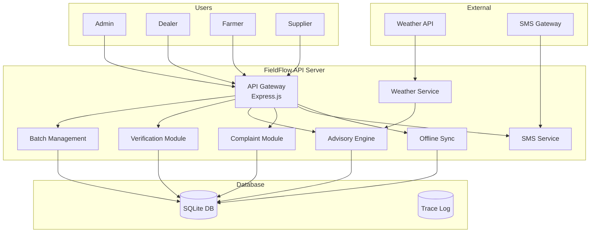
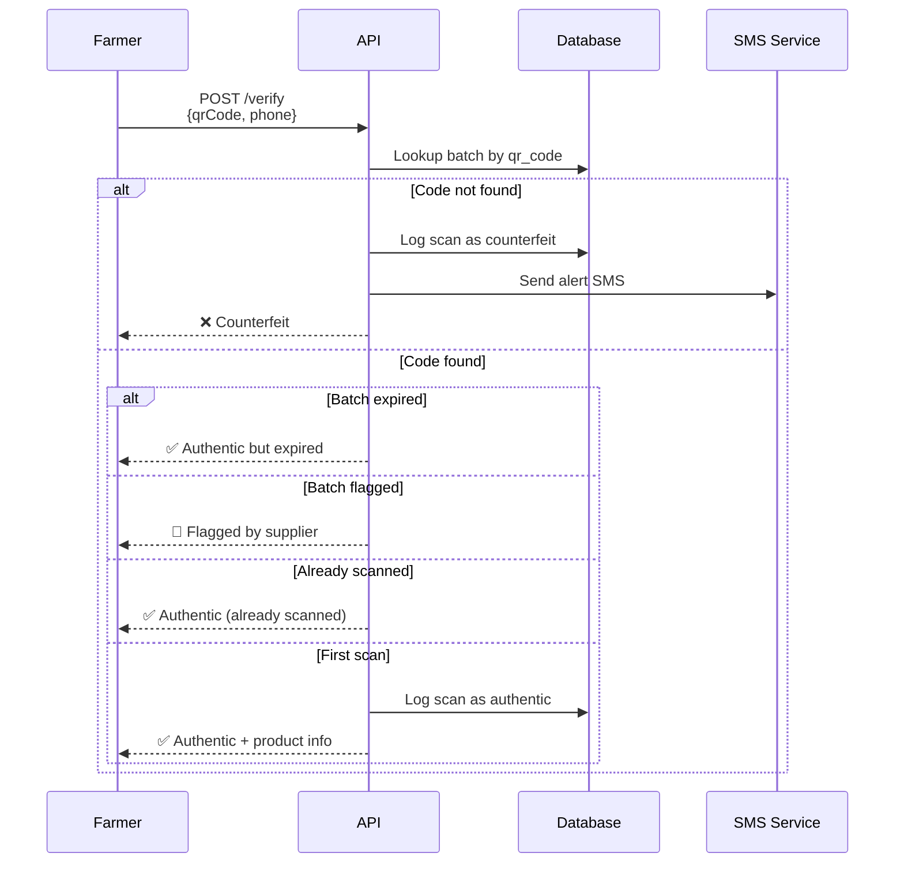
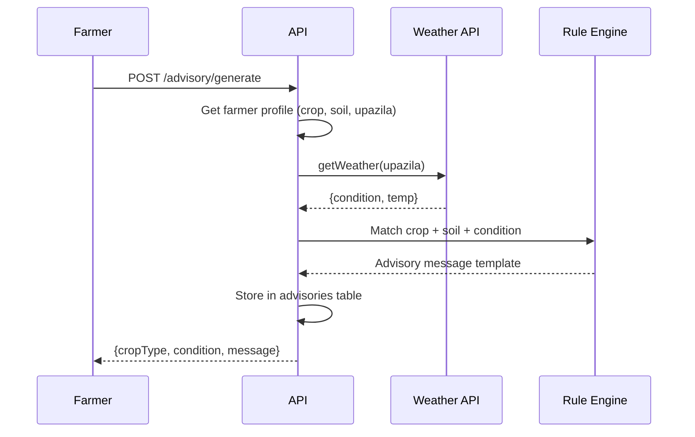
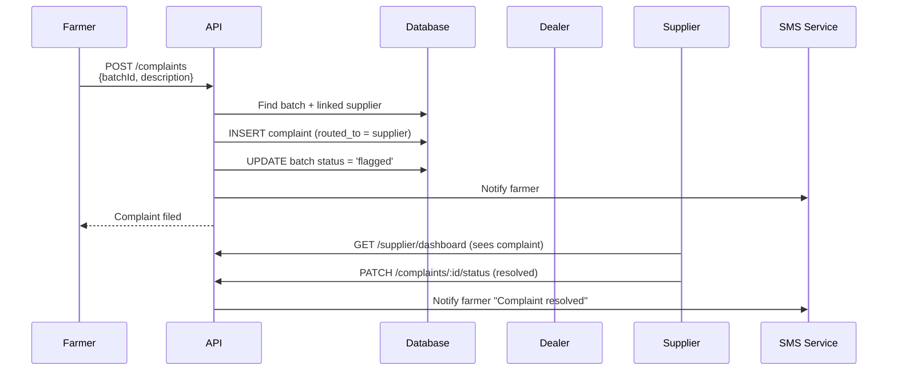
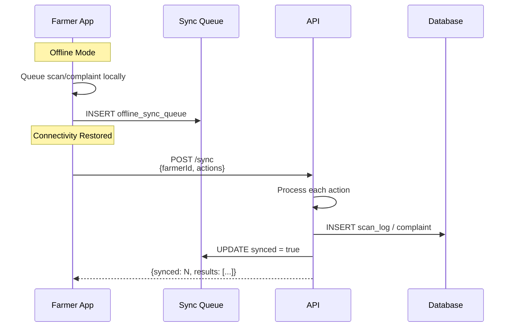
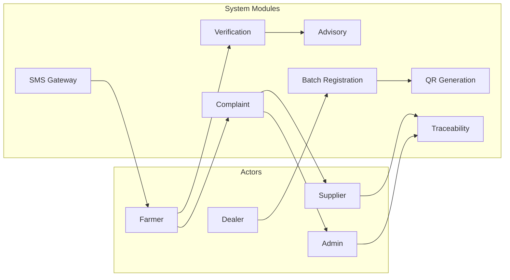
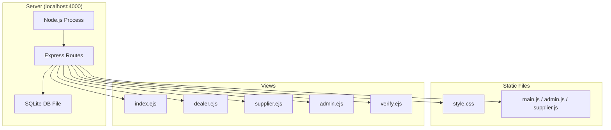

# FieldFlow — Architecture & Workflow Diagrams

## System Architecture



## Batch Registration Workflow

```mermaid
sequenceDiagram
    participant D as Dealer
    participant API as API
    participant QR as QR Service
    participant DB as Database

    D->>API: POST /batches<br/>{product, type, dates, quantity}
    API->>API: Verify JWT + role
    API->>QR: generateQrCode(batchId, dealerId, name)
    QR-->>API: {code, signature}
    API->>DB: INSERT batch with QR data
    DB-->>API: batch record
    API-->>D: 201 Created + batch JSON
    D->>API: GET /batches/:id/qr
    API->>QR: generateQrImage(code)
    QR-->>API: data:image/png;base64,...
    API-->>D: QR image
```

## QR Verification Workflow



## Advisory Engine Workflow



## Complaint Routing Workflow



## Data Flow — Offline Sync



## Actor Interactions



## Deployment View


